# Spartamarket-DRF

## 프로젝트 개요
DjangoDRF를 이용한 회원가입, 로그인 기능 밑 CRUD 기능 구현

## 주요 기능
- 회원가입, 로그인, 상품 등록, 글 조회, 글 수정, 글 삭제 기능

## ERD 이미지
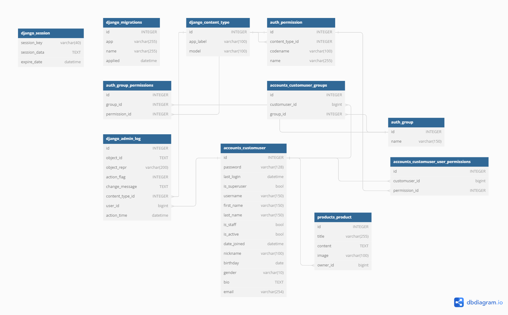

## API 테스트 (Postman 예시)

### 회원가입
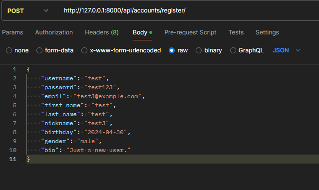
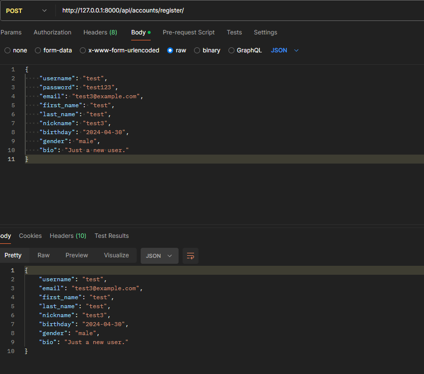

### 로그인
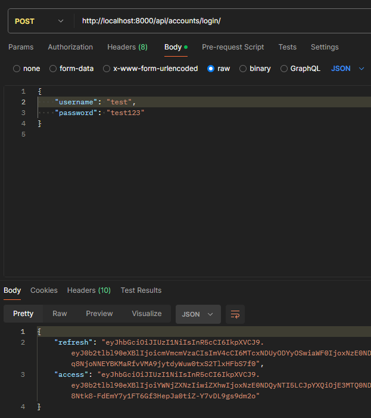

### 프로필 조회
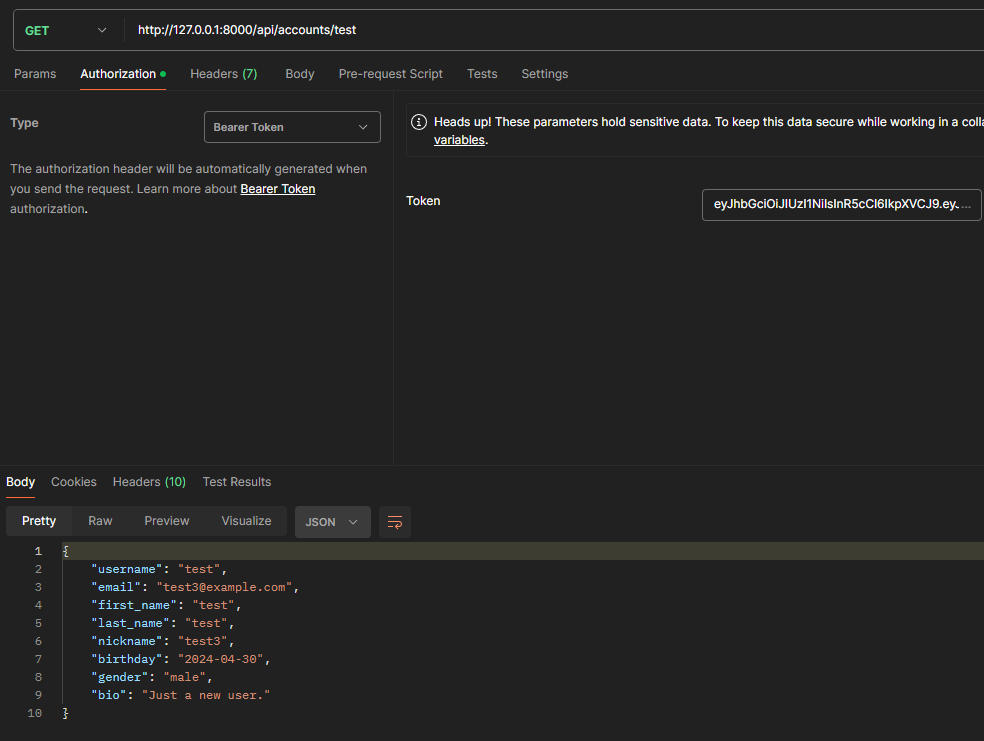

### 글 등록
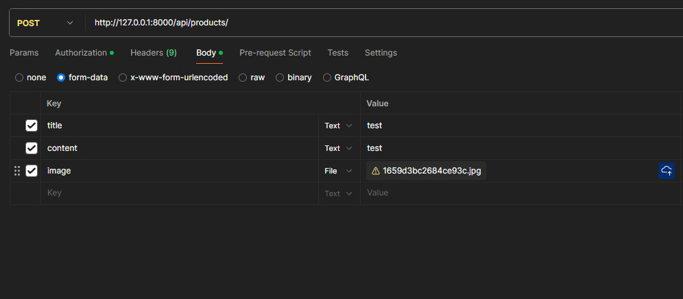
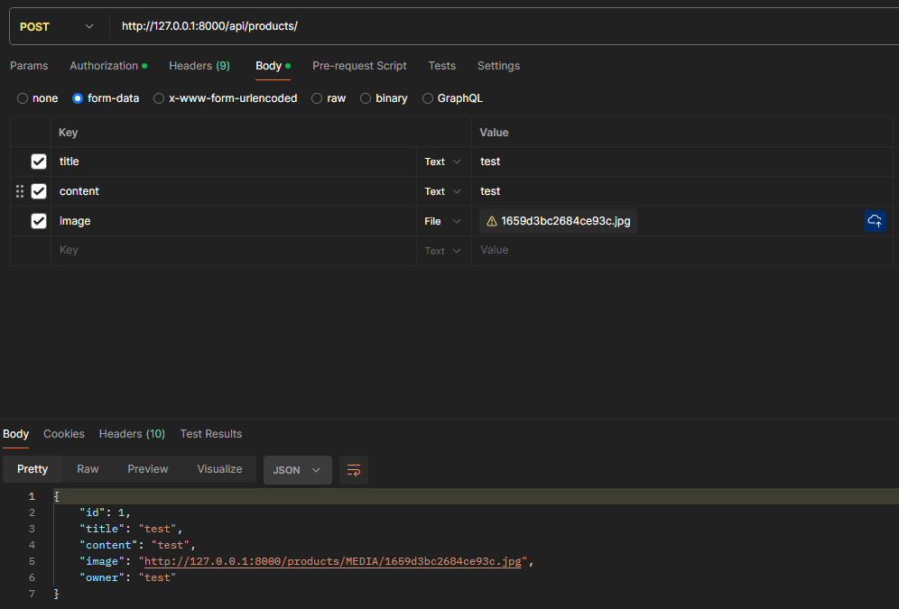

### 글 조회
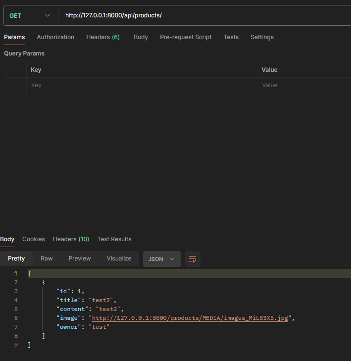

### 글 수정
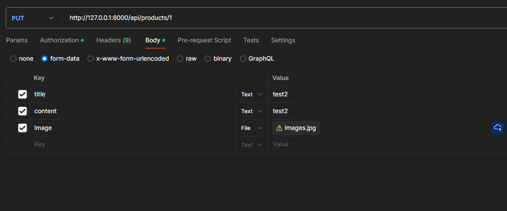
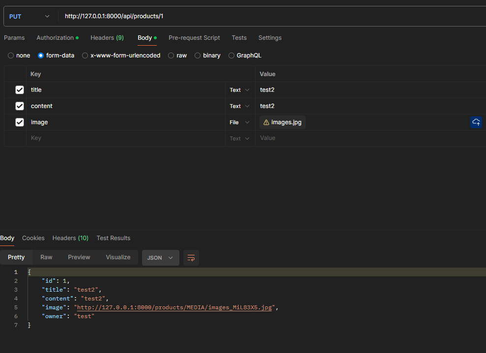

### 글 삭제
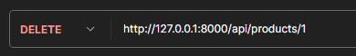

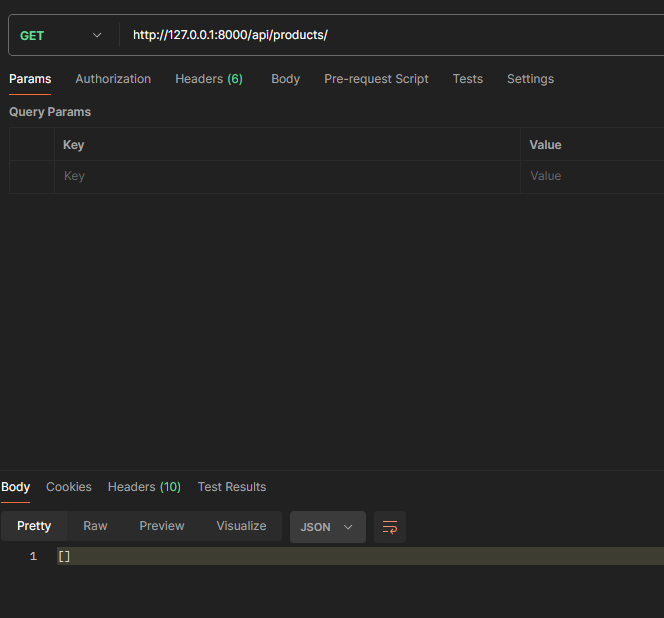

## 설치 및 실행 방법
    pip install -r requirements.txt 실행

    .env.example 파일이름을 .env로 바꾼후 SECRET_KEY 항목에 자신의 SECRET_KEY를 입력

    python manage.py migrate

    python manage.py runserver

Postman 사용하여 request 보내기
*body의 content-type은 json

회원가입 (Post): http://127.0.0.1:8000/api/accounts/register/
    
    body : 
    {
        "username": "your_username",
        "password": "your_password",
        "email": "your_email",
        "first_name": "your_first_name",
        "last_name": "your_last_name",
        "nickname": "your_nickname",
        "birthday": "YYYY-MM-DD",
        "gender": "your_gender",
        "bio": "your_bio"
    }
    양식 채워서 send

로그인 (Post): http://127.0.0.1:8000/api/accounts/login/
    
    {
        "username": "<your_username>",
        "password": "<your_password>"
    }
    회원가입 한 username과 password를 입력해서 send= fresh 토큰과 access 토큰 발행

지금부터 아래의 기능들은 로그인 후 받은 access 토큰을 Auth 탭에 bearer token으로 집어 넣어서 실행해야 함

프로필 조회 (Get): 
    
    http://127.0.0.1:8000/api/accounts/<username>

글 등록 (Post): 

    http://127.0.0.1:8000/api/products/

    Body 탭에서 form-data를 선택해 title(text),content(text), image(file) key를 만들어 value를 입력 후 send

글 조회 (Get)

    http://127.0.0.1:8000/api/products/

글 수정 (Post):

    http://127.0.0.1:8000/api/products/<product id>

    Body 탭에서 form-data를 선택해 title(text),content(text), image(file) key를 만들어 value를 입력 후 send

글 삭제 (Delete) : 

    http://127.0.0.1:8000/api/products/<product id>